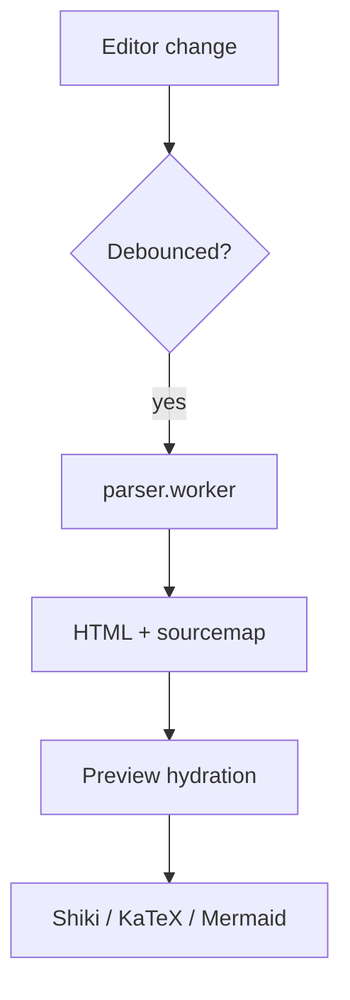
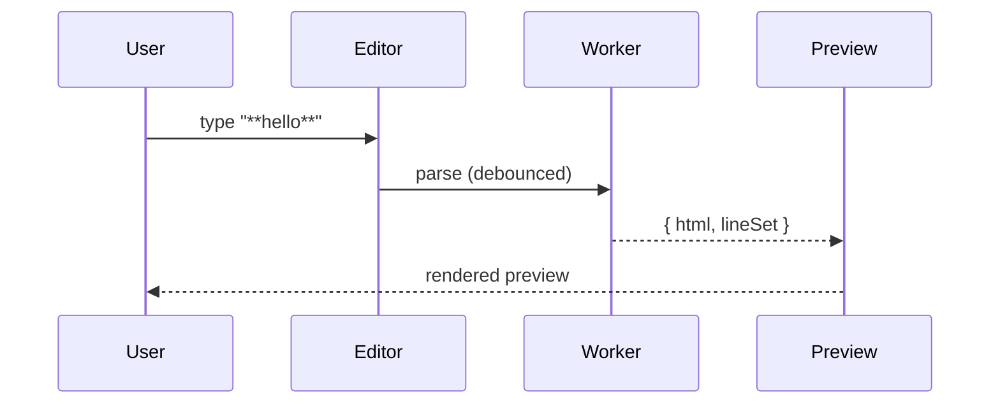
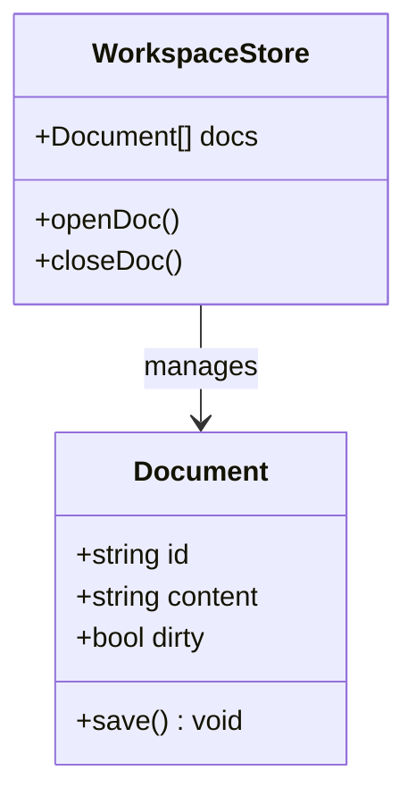
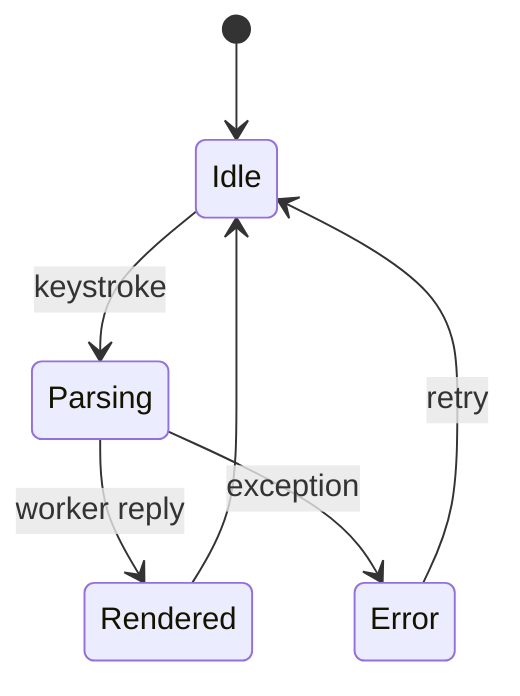

# Diagrams (Mermaid)

## Flowchart

```mermaid
graph TD
  A[Editor change] --> B{Debounced?}
  B -- yes --> C[parser.worker]
  C --> D[HTML + sourcemap]
  D --> E[Preview hydration]
  E --> F[Shiki / KaTeX / Mermaid]
```

## Sequence

```mermaid
sequenceDiagram
  participant U as User
  participant E as Editor
  participant W as Worker
  participant P as Preview
  U->>E: type "**hello**"
  E->>W: parse (debounced)
  W-->>P: { html, lineSet }
  P-->>U: rendered preview
```

## Class diagram

```mermaid
classDiagram
  class Document {
    +string id
    +string content
    +bool dirty
    +save() void
  }
  class WorkspaceStore {
    +Document[] docs
    +openDoc()
    +closeDoc()
  }
  WorkspaceStore --> Document : manages
```

## State

```mermaid
stateDiagram-v2
  [*] --> Idle
  Idle --> Parsing : keystroke
  Parsing --> Rendered : worker reply
  Rendered --> Idle
  Parsing --> Error : exception
  Error --> Idle : retry
```
